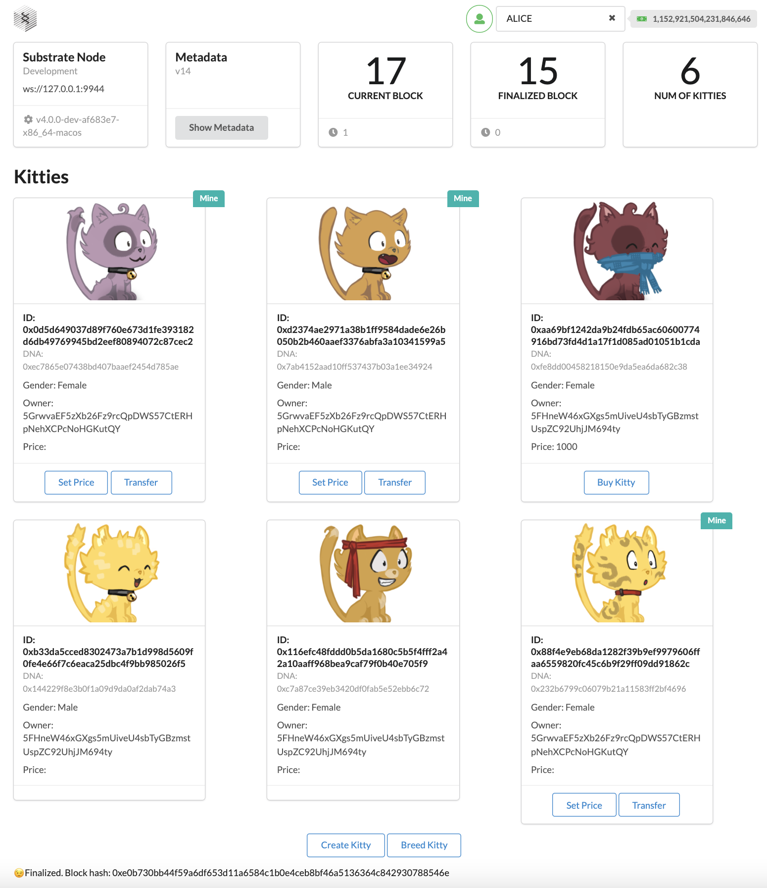

# Substrate Kitties Front End

## Source Code

Front-end: https://github.com/tofudfy/substrate-front-end-template

Related Backend: https://github.com/tofudfy/substrate-node-template

## Initialization

Go to the directory where you clone the Backend source code, run
```
# complie the code
cargo build --release

# run the complied binary file
./target/release/node-template --dev --tmp
```

Then, open another terminal and go to the directory where you clone the front-end source code, run
```
yarn install

yarn start
```

## Results

